# Machine Learning
*Generated 2026-03-29 · iMentor Lecture Generator · Local SGLang*

---

## Overview

A textbook that introduces the core concepts and theory of machine learning, focusing on algorithms and their applications.

### Learning Objectives

- Understand the basics of machine learning and its applications.
- Learn key algorithms and their theoretical foundations.
- Explore interdisciplinary concepts relevant to machine learning.

---

## Concept Map

> Interactive concept map: [concept_map.html](concept_map.html)

## Contents

1. [Machine Learning](#machine-learning) — *core*
2. [Computer Algorithms](#computer-algorithms) — *core*
3. [Experience-Based Improvement](#experience-based-improvement) — *core*
4. [Learning Algorithms](#learning-algorithms) — *core*
5. [Theoretical Issues](#theoretical-issues) — *core*
6. [Statistical Concepts](#statistical-concepts) — *supporting*
7. [Artificial Intelligence](#artificial-intelligence) — *supporting*
8. [Information Theory](#information-theory) — *supporting*
9. [Philosophical Perspectives](#philosophical-perspectives) — *supporting*
10. [Biology](#biology) — *supporting*
11. [Cognitive Science](#cognitive-science) — *supporting*
12. [Computational Complexity](#computational-complexity) — *supporting*
13. [Control Theory](#control-theory) — *supporting*
14. [Data Mining](#data-mining) — *supporting*
15. [Fraud Detection](#fraud-detection) — *supporting*
16. [Information Filtering](#information-filtering) — *supporting*
17. [Autonomous Vehicles](#autonomous-vehicles) — *supporting*
18. [Training Examples](#training-examples) — *supporting*
19. [Learning Tasks](#learning-tasks) — *supporting*
20. [Algorithm Implementation](#algorithm-implementation) — *supporting*
21. [Online Data Sets](#online-data-sets) — *supporting*
22. [Statistical Learning Theory](#statistical-learning-theory) — *supporting*
23. [Bayesian Learning](#bayesian-learning) — *supporting*
24. [Reinforcement Learning](#reinforcement-learning) — *supporting*
25. [Supervised Learning](#supervised-learning) — *supporting*
26. [Unsupervised Learning](#unsupervised-learning) — *supporting*
27. [Recurrent Neural Networks](#recurrent-neural-networks) — *supporting*
28. [Convolutional Neural Networks](#convolutional-neural-networks) — *supporting*
29. [Decision Trees](#decision-trees) — *supporting*
30. [Random Forests](#random-forests) — *supporting*

---

## 1. Machine Learning {#machine-learning}

### Definition

The study of algorithms that allow computer programs to automatically improve through experience.

### Intuition

Imagine you're teaching a computer to recognize cats. Initially, it might struggle to distinguish between cats and dogs. However, as it sees more images of cats and dogs, it starts to learn the patterns that make a cat a cat. This is the essence of machine learning—teaching computers to learn from data, much like how we learn from our experiences.

### Diagram

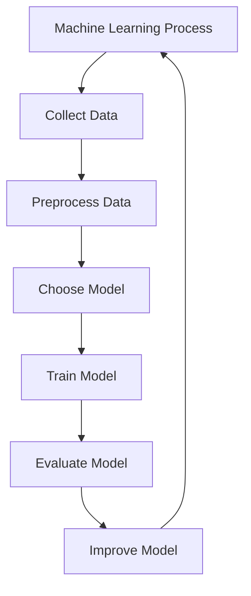

*A flowchart illustrating the iterative process of machine learning, from collecting and preprocessing data to training and evaluating the model, with the goal of improving the model's performance.*

### Examples

#### Data Mini Example

In the book, the authors discuss a scenario where a machine learning algorithm is trained to recognize dogs and cats. Initially, the algorithm might misclassify some dogs as cats. However, as it sees more examples, it learns to distinguish between the two more accurately.

#### Reinforcement Learning Example

In reinforcement learning, an agent learns to navigate a maze. Initially, it might randomly choose paths, but over time, it learns which paths lead to rewards and which lead to penalties. This process of trial and error allows the agent to improve its performance.

### Key Takeaways

- Machine learning involves algorithms that improve with experience.
- The process is iterative, involving data collection, preprocessing, model selection, training, evaluation, and improvement.
- Different types of machine learning include supervised, unsupervised, and reinforcement learning.

### Common Misconceptions

- ⚠️ Misconception: Machine learning is only about deep learning. 
Correction: While deep learning is a powerful subset of machine learning, it is not the only approach. Other methods like decision trees, support vector machines, and Bayesian networks are also used.
- ⚠️ Misconception: All machine learning requires labeled data. 
Correction: Unsupervised learning can work with unlabeled data, finding patterns and structures without explicit labels.

---

## 2. Computer Algorithms {#computer-algorithms}

### Definition

Computer algorithms designed to solve specific problems or perform tasks, improving their performance through experience.

### Intuition

Imagine a computer program as a student in a classroom. Just as a student learns from practice and feedback, a computer program learns from data and performance metrics. For example, a program that learns to play chess improves its strategy with each game, adjusting its moves based on the outcome. This process of learning from experience is fundamental to machine learning.

### Diagram

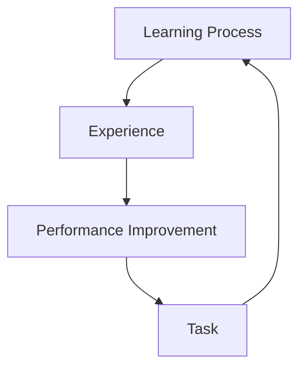

*The learning process where a computer program improves its performance on a task through experience.*

### Examples

#### Playing Chess

A computer program that plays chess learns from each game. After each move, it receives feedback on whether the move was successful or not. Over time, it adjusts its strategy based on these outcomes, improving its overall performance.

#### Image Recognition

A program that recognizes images learns from a dataset of labeled images. Initially, it makes mistakes, but with each correct identification, it refines its model, improving its accuracy over time.

### Key Takeaways

- Computer algorithms in machine learning learn from experience to improve performance on specific tasks.
- The learning process involves receiving feedback and adjusting the algorithm's parameters accordingly.
- Experience can come from various sources, such as data, user interactions, or feedback mechanisms.

### Common Misconceptions

- ⚠️ Misconception: Machine learning algorithms can learn without any data or feedback.
Correction: Machine learning algorithms require data and feedback to learn and improve their performance. Without these, they cannot adjust their parameters and improve.
- ⚠️ Misconception: All machine learning tasks require extensive computational resources.
Correction: While some tasks may require significant resources, others can be implemented efficiently, depending on the specific problem and the chosen algorithm.

---

## 3. Experience-Based Improvement {#experience-based-improvement}

### Definition

A computer program is said to learn from experience E with respect to some class of tasks T and performance measure P, if its performance at tasks in T, as measured by P, improves with experience E.

### Intuition

Imagine a child learning to ride a bicycle. Initially, the child might struggle to balance and steer. However, with each ride, the child gains more experience, and their ability to ride smoothly improves. Similarly, in machine learning, an algorithm starts with some initial performance and, through repeated exposure to data (experience), its performance on specific tasks improves. This process is akin to the child learning to ride the bicycle, where each ride provides new information and allows the child to refine their skills.

### Diagram

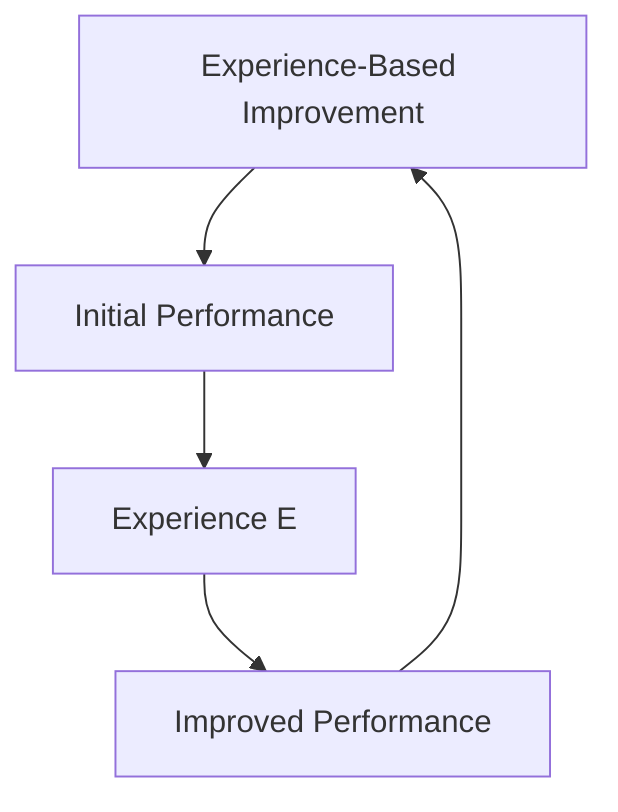

*A flowchart illustrating the process of experience-based improvement in machine learning. The algorithm starts with an initial performance, gains experience through exposure to data, and improves its performance, which then leads to further experience and continued improvement.*

### Examples

#### Learning to Play Chess

Consider a machine learning algorithm designed to play chess. Initially, the algorithm has a basic understanding of the game and makes random or suboptimal moves. As it plays more games, it learns from each encounter, adjusting its strategy based on the outcomes. Over time, the algorithm's performance improves, and it becomes better at winning games. This process is akin to a human player gaining experience and improving their skills through practice.

#### Image Recognition

A machine learning model trained to recognize handwritten digits (e.g., MNIST dataset) starts with a basic understanding of what digits look like. As it processes more images, it learns to distinguish between different digits more accurately. For example, the model might initially confuse a '6' and an '8', but with more exposure to examples of each, it learns to recognize the subtle differences and improve its accuracy. This is similar to how a person might learn to recognize different handwriting styles through repeated exposure.

### Key Takeaways

- Experience-based improvement is a fundamental concept in machine learning where an algorithm's performance on specific tasks improves through repeated exposure to data.
- The process involves initial performance, gaining experience, and then achieving improved performance, which can be iterated indefinitely.
- This concept is applicable across various types of machine learning tasks, from supervised to unsupervised learning.

### Common Misconceptions

- ⚠️ Misconception: Experience-based improvement only applies to supervised learning. 
Correction: While supervised learning is a common application, experience-based improvement is a broader concept that applies to all types of machine learning, including unsupervised, reinforcement, and semi-supervised learning.
- ⚠️ Misconception: Experience-based improvement is solely about accumulating more data. 
Correction: While more data can help, the key is the quality and relevance of the data, as well as the algorithm's ability to learn from it effectively.

---

## 4. Learning Algorithms {#learning-algorithms}

### Definition

Learning algorithms are mathematical procedures that enable a machine to improve its performance on a specific task through experience. These algorithms are a core component of machine learning, which involves designing and implementing algorithms that can learn from and make predictions or decisions based on data.

### Intuition

Imagine you are teaching a computer to recognize cats in photos. Initially, the computer might not know what a cat looks like. However, if you show it many examples of cats and non-cats, it can start to learn the features that distinguish cats from other animals. Over time, as it sees more examples, it gets better at recognizing cats. This is the essence of a learning algorithm—it learns from data to improve its performance.

### Mathematical Formulation

**Learning Performance**

$$
$P = \frac{1}{n} \sum_{i=1}^{n} I(y_i, \hat{y}_i)$
$$

*The performance of a learning algorithm is measured by the average accuracy of its predictions, where $y_i$ is the true label and $\hat{y}_i$ is the predicted label for the $i$-th example.*

**Training Examples**

$$
$T = \{(x_1, y_1), (x_2, y_2), ..., (x_n, y_n)\}$
$$

*A set of training examples, where each example consists of an input $x_i$ and its corresponding label $y_i$.*

**Learning Algorithm**

$$
$A(T) = \{\theta_1, \theta_2, ..., \theta_m\}$
$$

*The parameters or weights of a learning algorithm, which are adjusted during the learning process to minimize the error between predicted and actual labels.*

**Loss Function**

$$
$L = \sum_{i=1}^{n} L(y_i, \hat{y}_i)$
$$

*A measure of the error between the predicted and actual labels, where $L(y_i, \hat{y}_i)$ is the loss for the $i$-th example.*

### Diagram

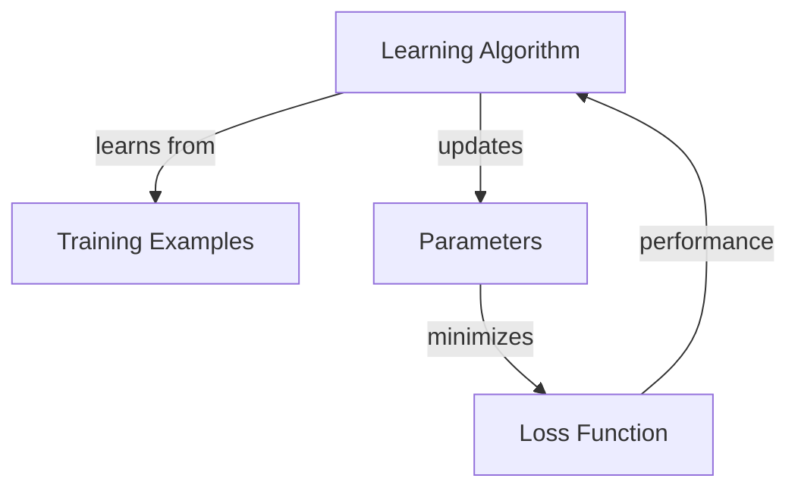

*A learning algorithm learns from training examples, updates its parameters to minimize the loss function, and ultimately improves its performance.*

### Examples

#### Logistic Regression

Logistic regression is a discriminative learning algorithm used for binary classification. It models the probability of a binary outcome using a logistic function. Given a set of training examples $T = \{(x_1, y_1), (x_2, y_2), ..., (x_n, y_n)\}$, where $y_i \in \{0, 1\}$, logistic regression aims to find the optimal parameters $\theta$ that minimize the cross-entropy loss function.

#### Perceptron Algorithm

The perceptron algorithm is another discriminative learning algorithm used for binary classification. It updates its parameters based on the difference between the predicted label and the true label. Given a set of training examples $T = \{(x_1, y_1), (x_2, y_2), ..., (x_n, y_n)\}$, where $y_i \in \{0, 1\}$, the perceptron algorithm updates its parameters $\theta$ using the rule $\theta = \theta + y_i x_i$ if $y_i \neq \text{sign}(\theta^T x_i)$.

### Key Takeaways

- Learning algorithms are mathematical procedures that enable a machine to improve its performance on a specific task through experience.
- Discriminative learning algorithms try to learn the mapping from inputs to labels directly, while generative learning algorithms model the joint distribution of inputs and labels.
- The performance of a learning algorithm is measured by the average accuracy of its predictions.
- Training examples, parameters, and the loss function are key components of a learning algorithm.

### Common Misconceptions

- ⚠️ Misconception: Reinforcement learning is a type of unsupervised learning. 
Correction: Reinforcement learning is a type of learning where an agent learns from its own experience, whereas unsupervised learning involves finding structure in unlabeled data.
- ⚠️ Misconception: All learning algorithms are created equal. 
Correction: Different learning algorithms are more appropriate for different types of learning tasks, and the choice of algorithm depends on the specific problem and available data.

---

## 5. Theoretical Issues {#theoretical-issues}

### Definition

Theoretical Issues in Machine Learning encompass the foundational concepts, questions, and challenges that arise from the mathematical and philosophical underpinnings of the field. These issues include the theoretical analysis of learning algorithms, the statistical properties of models, and the computational complexity of learning tasks.

### Intuition

Imagine you are trying to teach a computer to recognize images of cats. Theoretical Issues in Machine Learning are like asking, 'How can we ensure the computer learns effectively? What are the limits of what it can learn? And, how can we measure its success?' Just as you would need to understand the rules of a game to play it well, understanding these theoretical issues is crucial for building robust and efficient machine learning systems.

### Mathematical Formulation

**Bayes' Theorem**

$$
$P(A|B) = \frac{P(B|A)P(A)}{P(B)}$
$$

*This formula describes how to update the probability of a hypothesis given new evidence. In machine learning, it is used to update the probability of a model parameter given the data.*

**Loss Function**

$$
$L(\theta) = \sum_{i=1}^{n} l(y_i, \hat{y}_i(\theta))$
$$

*This equation represents the total loss of a model, where $\theta$ are the model parameters, $y_i$ are the true labels, and $\hat{y}_i(\theta)$ are the predicted labels. The goal is to minimize this loss.*

**Vapnik-Chervonenkis Dimension**

$$
$VC(H) = \max \{ n : \exists S \subset X, |S| = n, \text{such that } S \text{ is shattered by } H \}$
$$

*This formula defines the capacity of a hypothesis space $H$. It measures the complexity of a model and is crucial for understanding generalization bounds.*

### Diagram

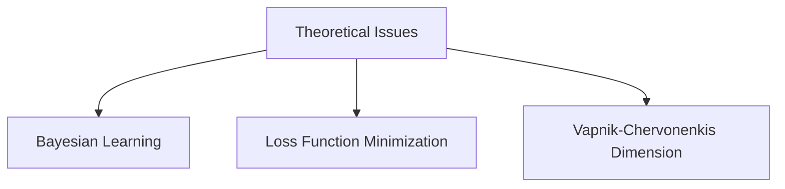

*Diagram illustrating the interconnected nature of theoretical issues in machine learning, including Bayesian learning, loss function minimization, and the Vapnik-Chervonenkis dimension.*

### Examples

#### Bayesian Learning Example

Consider a simple Bayesian learning scenario where we want to predict whether an email is spam or not. We use Bayes' Theorem to update our belief about the probability of an email being spam given the presence of certain words. This involves calculating the prior probability of spam, the likelihood of the words appearing in spam emails, and the overall probability of the words appearing. This example highlights the importance of understanding Bayesian methods in machine learning.

#### Loss Function Example

In a regression task, we might use the Mean Squared Error (MSE) as our loss function. Given a set of training examples, we calculate the MSE as the average of the squared differences between the predicted values and the true values. The goal is to minimize this MSE, which is a key theoretical issue in machine learning. This example demonstrates the practical application of minimizing a loss function.

### Key Takeaways

- Understand the role of theoretical issues in ensuring the effectiveness and robustness of machine learning systems.
- Learn to apply mathematical tools such as Bayes' Theorem, loss functions, and the Vapnik-Chervonenkis dimension to analyze and improve machine learning models.
- Recognize the importance of balancing model complexity and generalization in the context of machine learning.

### Common Misconceptions

- ⚠️ Misconception: Theoretical issues are only relevant for academic research and not for practical applications. 
Correction: Theoretical issues are crucial for practical applications as they provide a framework for understanding and improving the performance of machine learning models in real-world scenarios.
- ⚠️ Misconception: All machine learning problems can be solved with a single algorithm. 
Correction: Different problems may require different algorithms, and understanding the theoretical foundations helps in selecting the appropriate algorithm for a given task.

---

## 6. Statistical Concepts {#statistical-concepts}

### Definition

Statistical concepts encompass the fundamental principles and methods used in analyzing and interpreting data. In the context of machine learning, these concepts provide the theoretical underpinnings necessary for developing and evaluating learning algorithms. Key areas include probability distributions, statistical inference, and model evaluation techniques.

### Intuition

Imagine you are trying to predict the weather based on past data. Statistical concepts help you understand how to use historical weather patterns to make accurate forecasts. For example, you might use probability distributions to model the likelihood of different weather conditions. This is similar to how machine learning algorithms use statistical methods to learn from data and make predictions.

### Mathematical Formulation

**Probability Distribution**

$$
$P(X = x) = \frac{1}{Z} \exp(-E(X))$
$$

*This formula represents the probability of a random variable $X$ taking on a specific value $x$, where $Z$ is the normalization constant and $E(X)$ is the expected value of $X$.*

**Gaussian Discriminant Analysis (GDA)**

$$
$P(Y = y | X = x) = \frac{1}{(2\pi)^{d/2} |\Sigma|^{1/2}} \exp\left(-\frac{1}{2}(x - \mu_y)^T \Sigma^{-1} (x - \mu_y)\right)$
$$

*This formula calculates the posterior probability of class $y$ given a feature vector $x$ in a Gaussian discriminant analysis model, where $\mu_y$ is the mean vector, $\Sigma$ is the covariance matrix, and $d$ is the dimensionality of the feature space.*

**Logistic Regression**

$$
$P(Y = 1 | X) = \frac{1}{1 + \exp(-\beta^T X)}$
$$

*This formula represents the probability of the binary outcome $Y = 1$ given the feature vector $X$ and the parameter vector $\beta$. Logistic regression is a common method for binary classification tasks.*

### Diagram

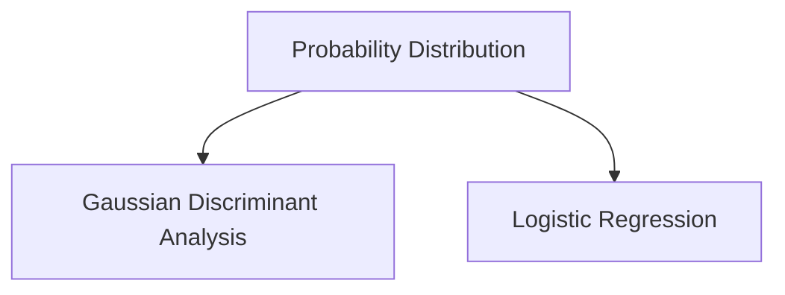

*Diagram illustrating the relationship between probability distributions and statistical models used in machine learning.*

### Examples

#### Gaussian Discriminant Analysis (GDA)

Consider a dataset with two classes, where the features are normally distributed. Using GDA, we can model the probability of each class and then classify new instances based on these probabilities. For example, if we have two classes, $Y = 0$ and $Y = 1$, and the features are normally distributed, we can use the following formulas to classify new instances:

#### Logistic Regression

Suppose we have a dataset with binary labels and continuous features. We can use logistic regression to model the probability of the positive class. For example, if we have a dataset with features $X_1, X_2, \ldots, X_n$ and the label $Y$, we can use the logistic regression formula to predict the probability of $Y = 1$:

### Key Takeaways

- Understand the basic principles of probability distributions and statistical inference.
- Learn how to use statistical models like Gaussian Discriminant Analysis and Logistic Regression for classification tasks.
- Appreciate the importance of model evaluation techniques in assessing the performance of statistical models.

### Common Misconceptions

- ⚠️ Misconception: Statistical models are only useful for predicting numerical outcomes. 
Correction: Statistical models can be used for both numerical and categorical outcomes, such as in classification tasks.
- ⚠️ Misconception: All statistical models are equally effective. 
Correction: The effectiveness of a statistical model depends on the specific problem and the quality of the data.

---

## 7. Artificial Intelligence {#artificial-intelligence}

### Definition

The study of intelligent agents and their capabilities, encompassing the design and development of systems that can perform tasks that typically require human intelligence, such as learning, reasoning, and problem-solving.

### Intuition

Imagine a robot that can learn from its experiences, much like how you learn from your daily activities. Just as you can improve your skills by practicing and making mistakes, an AI system can improve its performance by analyzing data and adjusting its behavior. This is akin to a student improving their grades by studying more and understanding the material better.

### Diagram


*Artificial Intelligence and its Related Concepts*

### Examples

#### Supervised Learning Example

Consider a scenario where a machine learning model is trained to classify emails as spam or not spam. The model is given a set of labeled training examples, where each example consists of an email and its corresponding label (spam or not spam). The model learns to recognize patterns in the emails that are indicative of spam, and it can then be used to classify new, unseen emails. This is a practical application of supervised learning in the field of spam filtering.

#### Reinforcement Learning Example

Imagine a robot navigating a maze. The robot receives a reward for reaching the end of the maze and a penalty for hitting a wall. Over time, the robot learns to navigate the maze more efficiently by adjusting its actions based on the rewards and penalties it receives. This is an example of reinforcement learning, where the agent learns to optimize its behavior based on feedback from the environment.

### Key Takeaways

- Artificial Intelligence encompasses a wide range of techniques and methods for creating intelligent agents.
- Machine Learning is a subset of AI that focuses on developing algorithms that can learn from data.
- Experience-Based Improvement is a key aspect of AI, where agents can learn from their experiences and improve their performance over time.
- Statistical Concepts and Information Theory are fundamental to understanding and designing AI systems.
- Reinforcement Learning is a specific type of AI that involves learning from feedback in the form of rewards and penalties.

### Common Misconceptions

- ⚠️ Misconception: AI is synonymous with human-level intelligence. 
Correction: While AI can perform tasks that are difficult for humans, it does not necessarily possess human-level intelligence. AI systems are designed to perform specific tasks and do not have the same breadth of knowledge or understanding as humans.
- ⚠️ Misconception: AI will replace all human jobs. 
Correction: AI is a tool that can augment human capabilities and automate repetitive tasks, but it is unlikely to replace all human jobs. Instead, it is more likely to change the nature of work and create new job opportunities.

---

## 8. Information Theory {#information-theory}

### Definition

The study of quantifying information and its transmission, which is fundamental to understanding how data is processed and communicated in machine learning systems.

### Intuition

Imagine you're trying to send a message to a friend. Information theory helps you understand how to encode that message in a way that minimizes errors and maximizes clarity. Just like how you might choose to send a message via text, email, or phone, information theory provides the tools to decide which method is best for your specific situation. It's about finding the most efficient way to communicate, whether it's through bits in a computer or neurons in the brain.

### Mathematical Formulation

**Entropy**

$$
H(X) = -\sum_{i} p(x_i) \log_2 p(x_i)
$$

*Entropy measures the uncertainty or randomness in a set of possible outcomes. In machine learning, it's used to quantify the information content of a dataset.*

**Mutual Information**

$$
I(X; Y) = \sum_{x, y} p(x, y) \log_2 \frac{p(x, y)}{p(x)p(y)}
$$

*Mutual information measures the amount of information that one random variable contains about another. It's crucial in understanding the relationship between different features in a dataset.*

### Diagram

```mermaid
graph TD;
A[Entropy]
B[Mutual Information]
C[Random Variable X]
D[Random Variable Y]
A -->|H(X)| C
B -->|I(X;Y)| C
C -->|p(x,y)| D
D -->|p(x)p(y)| C

```

*Diagram illustrating the concepts of Entropy and Mutual Information in Information Theory.*

### Examples

#### Example 1: Email Spam Detection

In email spam detection, information theory can help quantify the uncertainty in distinguishing spam emails from legitimate ones. By analyzing the entropy of the email content, we can determine how much information each word or phrase carries about whether the email is spam or not. This helps in designing more efficient spam filters.

#### Example 2: Image Compression

When compressing images, information theory helps in deciding which parts of the image can be discarded without significantly affecting the overall quality. By calculating the entropy of different color channels, we can identify which channels have the most information and prioritize their preservation.

### Key Takeaways

- Understand the role of entropy in quantifying the uncertainty in a dataset.
- Learn how to use mutual information to measure the relationship between different features in a dataset.
- Appreciate the importance of information theory in designing efficient and accurate machine learning models.

### Common Misconceptions

- ⚠️ Misconception: Information theory is only about compressing data. 
Correction: While data compression is a practical application, information theory is broader and encompasses the study of information transmission, uncertainty, and the relationship between different data sources.
- ⚠️ Misconception: All information is equally important. 
Correction: Information theory helps in identifying which parts of the data carry the most relevant information, allowing for more efficient processing and transmission.

---

## 9. Philosophical Perspectives {#philosophical-perspectives}

### Definition

Philosophical Perspectives in Machine Learning encompass the theoretical and philosophical foundations that underpin the development and application of machine learning techniques. These perspectives explore the nature of learning, intelligence, and the relationship between machines and humans, providing a broader context for understanding machine learning beyond just technical implementations.

### Intuition

Imagine a machine learning system as a student in a classroom. Just as a student learns from experience, a machine learning system improves through exposure to data. However, the process of learning is not just about memorizing facts; it involves understanding, reasoning, and making decisions. Philosophical perspectives delve into the essence of these processes, asking questions like: What does it mean for a machine to 'understand'? How can we ensure that machine learning systems are aligned with human values and ethics?

### Diagram

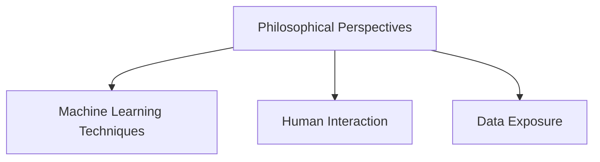

*Diagram illustrating the interconnected nature of philosophical perspectives, machine learning techniques, human interaction, and data exposure in the context of machine learning.*

### Examples

#### Reinforcement Learning vs. Unsupervised Learning

Reinforcement learning and unsupervised learning are two distinct paradigms in machine learning. Reinforcement learning involves an agent learning from its own experience, much like a student learning from trial and error. In contrast, unsupervised learning focuses on finding hidden structures in unlabeled data, akin to a detective solving a mystery without explicit guidance. While both involve learning, they differ fundamentally in their goals and methods.

#### Bayesian Learning

Bayesian learning is a statistical approach that incorporates prior knowledge into the learning process. It can be seen as a way to update beliefs based on new evidence. For example, a machine learning model might start with a prior belief about the distribution of data and then update this belief as it encounters more data. This process is analogous to a scientist refining their hypotheses based on experimental results.

### Key Takeaways

- Understand that machine learning is not just about algorithms and data; it involves philosophical questions about the nature of learning and intelligence.
- Recognize the importance of aligning machine learning techniques with human values and ethics.
- Appreciate the interconnectedness of philosophical perspectives, machine learning techniques, human interaction, and data exposure.

### Common Misconceptions

- ⚠️ Misconception: Machine learning is purely technical and does not involve philosophical considerations. 
Correction: Machine learning is deeply intertwined with philosophical questions about the nature of learning, intelligence, and the relationship between machines and humans. Ignoring these philosophical aspects can lead to unintended consequences and ethical dilemmas.
- ⚠️ Misconception: Reinforcement learning is a form of unsupervised learning. 
Correction: While both involve learning, reinforcement learning focuses on learning from experience and feedback, whereas unsupervised learning aims to discover hidden structures in data. These are distinct paradigms with different goals and methods.

---

## 10. Biology {#biology}

### Definition

The application of biological principles to enhance the design and functionality of machine learning algorithms and systems.

### Intuition

Imagine a machine learning system as a brain that learns from experience. Just as a brain adapts and learns through interactions with the environment, a machine learning system can be designed to learn from its interactions with data. Biological principles such as neural networks, synaptic plasticity, and adaptive learning can be mimicked in algorithms to improve their performance and efficiency.

### Diagram

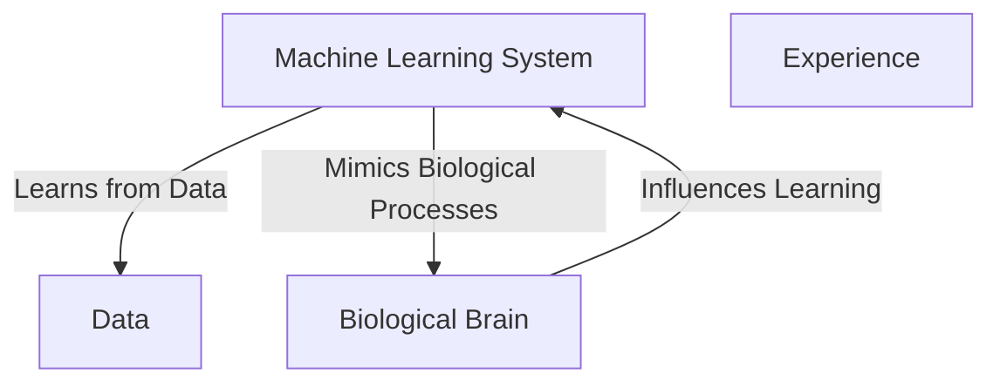

*Diagram illustrating the relationship between a machine learning system and a biological brain, emphasizing the learning process and the influence of biological principles on machine learning.*

### Examples

#### Neural Networks Inspired by Biological Neural Networks

Neural networks in machine learning are modeled after the structure and function of the human brain. Each neuron in a neural network can be thought of as a biological neuron, and the connections between neurons are analogous to the synaptic connections in the brain. The activation function in a neural network mimics the firing of a neuron, and backpropagation is similar to the process of synaptic plasticity, where connections are strengthened or weakened based on the input and output.

#### Reinforcement Learning and Biological Reward Systems

Reinforcement learning algorithms can be designed to mimic the reward systems in the brain. Just as a brain learns to associate actions with rewards to optimize behavior, a machine learning system can be trained to associate actions with rewards to optimize its performance. For example, a robot can be programmed to learn to navigate a maze by receiving positive reinforcement for reaching the goal and negative reinforcement for hitting obstacles.

### Key Takeaways

- Understand that biological principles can be applied to enhance machine learning algorithms.
- Recognize that neural networks and reinforcement learning can be inspired by biological systems.
- Appreciate the role of experience and data in both biological and machine learning systems.

### Common Misconceptions

- ⚠️ Misconception: Biological principles are only relevant to biological sciences and have no place in machine learning.
Correction: Biological principles can provide valuable insights and models for designing more efficient and adaptive machine learning systems.
- ⚠️ Misconception: Machine learning algorithms are purely mathematical and do not require any biological inspiration.
Correction: Incorporating biological principles can lead to more robust and efficient algorithms, as seen in the design of neural networks and reinforcement learning.

---

## 11. Cognitive Science {#cognitive-science}

### Definition

The interdisciplinary study of the mind and its processes, combining insights from psychology, neuroscience, linguistics, philosophy, and artificial intelligence to understand how the brain works and how it gives rise to mental activities such as perception, thought, and action.

### Intuition

Imagine your brain as a complex network of interconnected nodes, much like a city with its streets, buildings, and people. Cognitive science is like studying this city to understand how it functions, how its inhabitants interact, and how it evolves over time. Just as a city planner might look at traffic patterns, building designs, and population trends to improve the city, cognitive scientists look at brain activity, neural connections, and mental processes to understand and enhance the human mind.

### Diagram

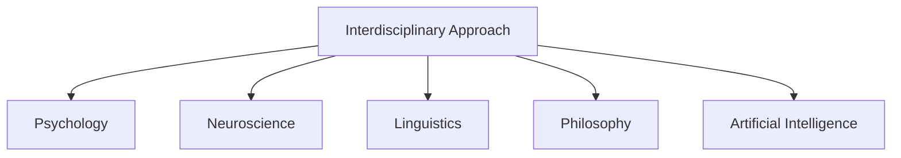

*Interdisciplinary Structure of Cognitive Science*

### Examples

#### Symbolic Reasoning vs. Connectionism

In the early 1980s, most cognitive scientists studied symbolic reasoning models, which were based on the idea that the mind works like a computer, using symbols and rules to process information. However, these models were difficult to explain in terms of how the brain could actually implement them using neurons. In contrast, the connectionists began to study models that were more closely aligned with the brain's neural network structure, focusing on how patterns of activation in the brain could give rise to mental processes.

#### Connectionist Models

Connectionist models, such as those proposed by McClelland et al. (1995), are based on the idea that the mind works like a neural network, with nodes representing neurons and connections representing the strength of the connections between neurons. These models can be used to simulate various mental processes, such as learning and memory, and can be implemented in artificial neural networks.

### Key Takeaways

- Cognitive science is an interdisciplinary field that combines insights from multiple disciplines to understand the mind and its processes.
- It focuses on the structure and function of the brain, as well as the mental processes that arise from it.
- The field has evolved to include both symbolic and connectionist models of the mind, each with its own strengths and limitations.

### Common Misconceptions

- ⚠️ Misconception: Cognitive science is solely about studying the brain's physical structure. 
Correction: While the brain's structure is important, cognitive science also focuses on the mental processes that arise from it, such as perception, thought, and action.
- ⚠️ Misconception: Cognitive science is only relevant to psychology. 
Correction: Cognitive science is interdisciplinary, combining insights from psychology, neuroscience, linguistics, philosophy, and artificial intelligence.

---

## 12. Computational Complexity {#computational-complexity}

### Definition

The study of the resources required to solve computational problems, particularly in the context of machine learning, focusing on the computational effort, number of training examples, number of mistakes, etc., required to learn.

### Intuition

Imagine you're trying to teach a computer to recognize images of cats. Computational complexity is about understanding how much 'work' the computer needs to do to learn this task. This includes the number of examples it needs to see, the number of mistakes it can make before it learns, and the amount of computational power required. Just like how it might take you more time and effort to learn a new language than to learn to ride a bicycle, the computational complexity of a task can vary widely based on the nature of the task and the learning algorithm used.

### Mathematical Formulation

**Sample Complexity Bound**

$$
n \geq \frac{2}{\epsilon^2} (\log(2d/\delta) + 1) \quad \text{for} \quad \text{error rate} \leq \epsilon
$$

*This formula gives a theoretical bound on the number of training examples (n) needed to achieve a certain error rate (ε) with high probability (1 - δ) in a learning task. Here, d is the dimensionality of the input space.*

**Bias-Variance Tradeoff**

$$
\text{Error} = \text{Bias}^2 + \text{Variance} + \text{Irreducible Error}
$$

*This equation decomposes the total error in a prediction into three components: the bias (systematic error), the variance (sensitivity to fluctuations in the training data), and the irreducible error (noise in the data). Balancing these components is crucial in machine learning.*

### Diagram

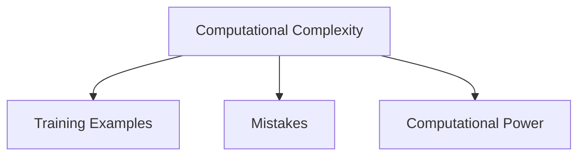

*A diagram illustrating the factors contributing to computational complexity in machine learning tasks.*

### Examples

#### Naive Bayes Classifier

Consider a naive Bayes classifier used to classify emails as spam or not spam. The computational complexity involves estimating the probabilities of each word in the email being spam or not spam. The number of training examples needed to achieve a certain accuracy, the number of mistakes the classifier can make, and the computational power required to process the emails are all factors in the computational complexity.

#### Neural Networks

In multi-layer neural networks, the computational complexity includes the number of parameters to be learned, the number of training examples needed, and the computational power required to train the network. For example, a simple neural network with one hidden layer might have a lower computational complexity than a deep neural network with many hidden layers.

### Key Takeaways

- Understanding the computational complexity of a learning task is crucial for designing efficient machine learning algorithms.
- Theoretical bounds on computational complexity can help in predicting the performance of different learning algorithms.
- Factors such as the number of training examples, the number of mistakes, and the computational power required are all important in determining the computational complexity.

### Common Misconceptions

- ⚠️ Misconception: Computational complexity is solely about the amount of computational power required. 
Correction: While computational power is a factor, it is also about the number of training examples, the number of mistakes, and the inherent complexity of the learning task.
- ⚠️ Misconception: All learning tasks have the same computational complexity. 
Correction: The computational complexity can vary widely depending on the nature of the task and the learning algorithm used.

---

## 13. Control Theory {#control-theory}

### Definition

Control theory is a branch of engineering and mathematics that deals with the behavior of dynamical systems and their control mechanisms. In the context of machine learning, it involves designing algorithms that can learn to control processes to optimize predefined objectives and predict the next state of the process. This is particularly relevant in areas such as autonomous vehicles, robotics, and adaptive systems where the system needs to make decisions based on feedback to achieve a desired outcome.

### Intuition

Imagine you are trying to navigate a car through a complex, dynamic environment. Control theory helps you design the algorithms that tell the car how to steer, accelerate, and brake to reach your destination safely and efficiently. In machine learning, we use similar principles to design algorithms that can learn from data and make decisions to optimize certain metrics, such as accuracy or efficiency.

### Mathematical Formulation

**State Equation**

$$
$\dot{x}(t) = Ax(t) + Bu(t)$
$$

*The state equation describes the evolution of the state of a dynamical system over time. Here, $x(t)$ is the state vector, $A$ is the system matrix, $u(t)$ is the input vector, and $B$ is the input matrix.*

**Control Law**

$$
$u(t) = Kx(t) + r(t)$
$$

*The control law determines the input to the system based on the current state and a reference signal. Here, $K$ is the gain matrix, $x(t)$ is the state vector, and $r(t)$ is the reference signal.*

### Diagram

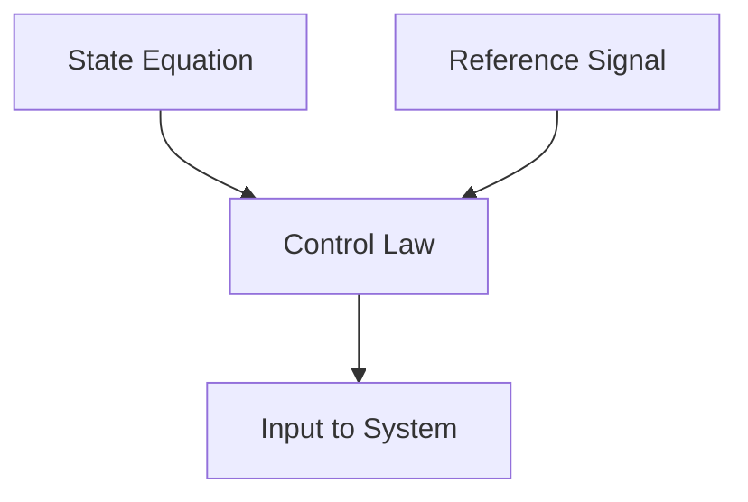

*Diagram illustrating the relationship between the state equation, control law, and the reference signal in a control system.*

### Examples

#### Reinforcement Learning in Robotics

In robotics, control theory is used to design reinforcement learning algorithms that allow robots to learn optimal actions to achieve a goal. For example, a robot might learn to navigate a maze by receiving rewards for reaching the end and penalties for hitting obstacles. The control law would determine the robot's movements based on the current state and the reference signal (the desired path).

#### Autonomous Vehicles

Autonomous vehicles use control theory to make real-time decisions about steering, acceleration, and braking. The state equation describes the vehicle's current position and velocity, while the control law determines the optimal actions to take based on the reference signal (the desired trajectory).

### Key Takeaways

- Control theory is essential for designing algorithms that can learn to control processes and optimize predefined objectives.
- It involves understanding the dynamics of the system and designing control laws that can adapt to changing conditions.
- Control theory is widely applicable in machine learning, particularly in areas such as robotics, autonomous vehicles, and adaptive systems.

### Common Misconceptions

- ⚠️ Misconception: Control theory is only applicable to physical systems. 
Correction: While it originated in the study of physical systems, control theory has been successfully applied to a wide range of domains, including machine learning, where it is used to design algorithms that can learn to control processes and optimize objectives.
- ⚠️ Misconception: Control theory is a static field with no relevance to modern machine learning. 
Correction: Control theory is an active and evolving field that continues to provide valuable insights and techniques for modern machine learning, particularly in areas such as reinforcement learning and adaptive systems.

---

## 14. Data Mining {#data-mining}

### Definition

The process of discovering patterns in large data sets, often using machine learning algorithms to automatically uncover valuable implicit regularities.

### Intuition

Imagine you have a vast library of books, and you want to find all the books that discuss a specific topic, like 'data mining.' Data mining is like using a powerful search tool to sift through the entire library, not just by keywords, but by understanding the context and relationships between the books. Machine learning algorithms act as these powerful search tools, analyzing the data to find hidden patterns and insights.

### Diagram

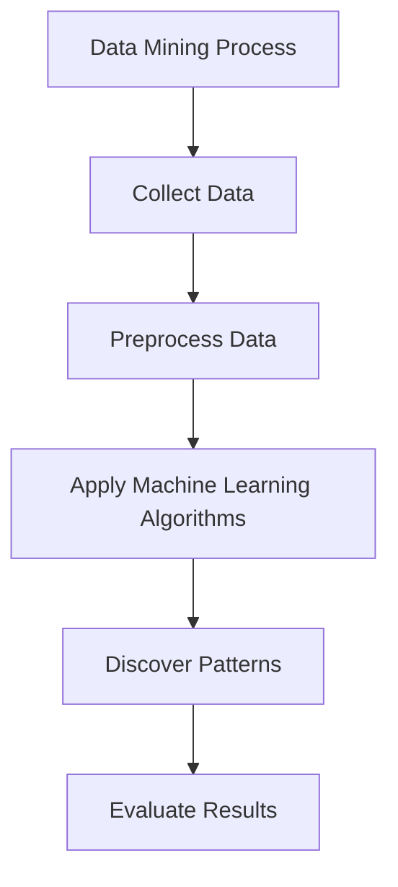

*Data Mining Process Flowchart*

### Examples

#### Medical Treatment Outcomes

A hospital has a large database of patient records, including treatment outcomes. By applying data mining techniques, researchers can discover patterns that indicate which treatments are most effective for certain conditions. For example, they might find that patients who received a specific combination of medications had significantly better recovery rates.

#### Credit Risk Assessment

A financial institution uses data mining to analyze large databases of customer financial information to identify patterns that correlate with credit risk. This can help in creating more accurate models for assessing the likelihood of default, improving the institution's risk management strategies.

### Key Takeaways

- Data mining is a subset of machine learning focused on discovering patterns in large data sets.
- It involves collecting, preprocessing, and applying machine learning algorithms to the data to uncover valuable insights.
- The goal is to automate the process of finding hidden patterns and relationships in the data.

### Common Misconceptions

- ⚠️ Misconception: Data mining is only about finding correlations in data. 
Correction: While correlations are important, data mining also involves discovering more complex patterns, such as clusters, anomalies, and predictive models.
- ⚠️ Misconception: Data mining can solve all problems in data analysis. 
Correction: Data mining is a tool, and its effectiveness depends on the quality and relevance of the data, as well as the appropriate choice of algorithms and techniques.

---

## 15. Fraud Detection {#fraud-detection}

### Definition

Systems that learn to detect fraudulent activities using machine learning techniques.

### Intuition

Imagine a detective who can spot suspicious behavior in a crowd. Just as a detective might notice unusual patterns or behaviors that indicate fraud, a machine learning system can be trained to recognize these same patterns. By analyzing vast amounts of data, the system can learn to distinguish between normal and fraudulent activities, much like how a detective learns to spot a thief in a busy market.

### Diagram

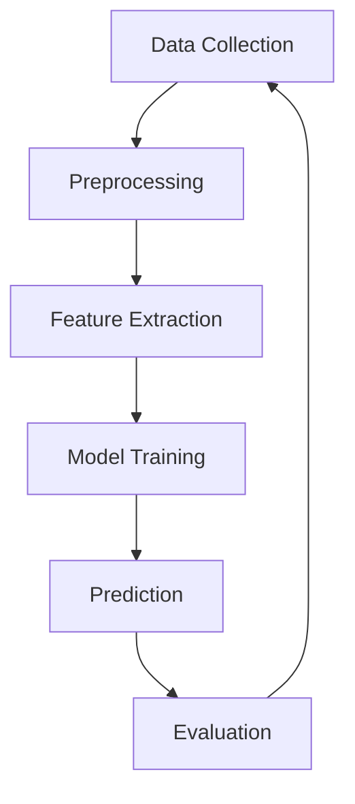

*A flowchart illustrating the process of training a machine learning model for fraud detection.*

### Examples

#### Credit Card Fraud Detection

A machine learning model is trained on historical data of credit card transactions, including both fraudulent and legitimate transactions. The model learns to identify patterns that are indicative of fraud, such as unusual spending habits or transactions occurring in different geographical locations within a short period. Once trained, the model can predict whether new transactions are likely to be fraudulent.

#### Financial Transaction Fraud Detection

A financial institution uses a machine learning model to monitor real-time transactions. The model is trained on a dataset of past transactions, including both fraudulent and legitimate ones. By analyzing the transaction data, the model can flag suspicious activities, such as large sums of money being transferred to unfamiliar accounts, which might indicate fraudulent behavior.

### Key Takeaways

- Fraud detection systems use machine learning to identify patterns indicative of fraudulent activities.
- The process involves data collection, preprocessing, feature extraction, model training, prediction, and evaluation.
- These systems can be applied in various domains, such as credit card transactions and financial transactions.

### Common Misconceptions

- ⚠️ Misconception: Reinforcement learning is a form of unsupervised learning.
Correction: Reinforcement learning is distinct from unsupervised learning. While unsupervised learning focuses on finding hidden structures in unlabeled data, reinforcement learning involves learning from a sequence of states and actions through trial and error, with the goal of maximizing a reward signal.
- ⚠️ Misconception: Supervised and unsupervised learning encompass all machine learning paradigms.
Correction: Although supervised and unsupervised learning are important, there are other paradigms such as semi-supervised learning, active learning, and reinforcement learning, which are not covered by these two categories.

---

## 16. Information Filtering {#information-filtering}

### Definition

Information filtering systems are machine learning applications designed to prioritize and filter information based on user preferences and behavior. These systems learn from user interactions and adapt to provide more relevant and useful information over time.

### Intuition

Imagine you have a vast library of books, and you want to find the most interesting and relevant ones for you. An information filtering system is like a librarian who knows your reading habits and preferences. Over time, this librarian learns to recommend the best books for you, just like a friend who knows your tastes. In the digital age, these systems are used to filter emails, news articles, and other content to ensure that you only see what is most relevant to you.

### Diagram


*Mermaid diagram illustrating the process of information filtering. The system takes user input, filters relevant information, and receives feedback to improve its performance.*

### Examples

#### Email Filtering

A common example of information filtering is email filtering. Gmail uses machine learning to categorize emails into different folders based on user behavior. Initially, the system learns from your actions—marking emails as spam, moving them to the inbox, or deleting them. Over time, it becomes more accurate in predicting which emails you will find useful and which you will ignore.

#### News Article Filtering

Another example is news article filtering. An app like Flipboard uses machine learning to recommend articles that match your interests. Initially, it learns from your reading habits—articles you read, bookmark, or skip. Based on this, it suggests more relevant articles, improving its recommendations over time.

### Key Takeaways

- Information filtering systems are a type of machine learning application designed to prioritize and filter information based on user preferences and behavior.
- These systems learn from user interactions and adapt to provide more relevant and useful information over time.
- Examples of information filtering include email filtering and news article filtering.

### Common Misconceptions

- ⚠️ Misconception: Information filtering is the same as unsupervised learning. 
Correction: While unsupervised learning involves finding hidden patterns in unlabeled data, information filtering specifically focuses on filtering and prioritizing information based on user behavior and preferences. Unsupervised learning does not necessarily involve user interaction or feedback.
- ⚠️ Misconception: Information filtering is only useful for personalization. 
Correction: While personalization is a key application, information filtering is also used in various other contexts, such as fraud detection, autonomous vehicles, and data mining. It helps in making systems more efficient and user-friendly.

---

## 17. Autonomous Vehicles {#autonomous-vehicles}

### Definition

Autonomous vehicles are systems that learn to operate vehicles autonomously using machine learning techniques. They are designed to navigate public highways and perform driving tasks without human intervention, relying on sensors, cameras, and machine learning models to make decisions and adapt to changing environments.

### Intuition

Imagine a car that can drive itself, just like you would drive it. Autonomous vehicles use cameras, sensors, and machine learning to understand the road, other vehicles, and pedestrians. They learn from experience, much like how you learn to drive better with practice. The car can recognize traffic signs, stop at red lights, and navigate through traffic, all while continuously improving its performance through machine learning.

### Diagram

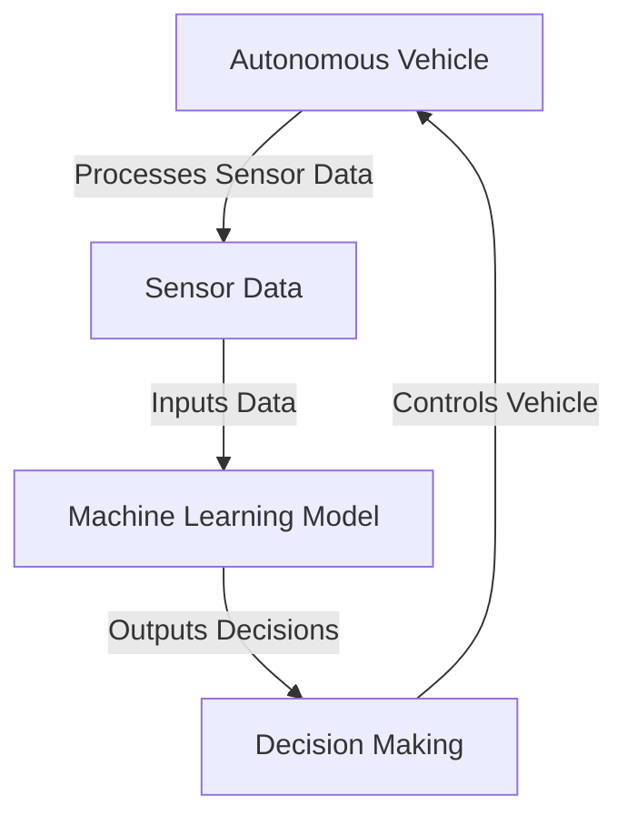

*Autonomous Vehicle Decision-Making Process*

### Examples

#### Training Autonomous Vehicles

Autonomous vehicles are trained using large datasets of driving scenarios. For example, a car might be trained on a dataset of millions of images and corresponding steering commands. The machine learning model learns to predict the correct steering angle based on the input images. This process is similar to how a human driver learns to steer the car by observing the road and making adjustments.

#### Real-World Application: Waymo

Waymo, a subsidiary of Alphabet Inc., has been developing autonomous vehicles for several years. They use a combination of machine learning and sensor data to navigate public roads. For instance, Waymo’s vehicles can detect pedestrians, other vehicles, and traffic signs, and make decisions about when to stop, accelerate, or change lanes. This is a practical example of how autonomous vehicles use machine learning to operate in real-world environments.

### Key Takeaways

- Autonomous vehicles use machine learning to learn from experience and improve their performance over time.
- They rely on sensor data and machine learning models to make decisions and navigate public highways.
- Training involves large datasets of driving scenarios to teach the vehicle how to respond to different situations.

### Common Misconceptions

- ⚠️ Misconception: Autonomous vehicles are fully autonomous and do not require any human intervention. 
Correction: While autonomous vehicles can operate without human intervention, they are typically designed with fallback mechanisms, such as emergency braking systems, to ensure safety in case of system failures or unexpected situations.
- ⚠️ Misconception: Machine learning is the only technology used in autonomous vehicles. 
Correction: Autonomous vehicles also rely on other technologies, such as sensors, GPS, and control systems, to function properly. Machine learning is just one component of the overall system.

---

## 18. Training Examples {#training-examples}

### Definition

Data used to train learning algorithms. In the context of machine learning, training examples are the inputs and their corresponding outputs that the algorithm uses to learn the underlying patterns and make predictions. They are the foundation upon which the learning process is built, enabling the algorithm to generalize and make accurate predictions on unseen data.

### Intuition

Imagine you are teaching a child to recognize different fruits. You show them an apple and say 'This is an apple.' Then you show them a banana and say 'This is a banana.' Over time, the child learns to recognize the features that distinguish apples from bananas. Similarly, in machine learning, training examples are like showing the algorithm examples of apples and bananas, allowing it to learn the patterns and make predictions on new, unseen examples.

### Diagram

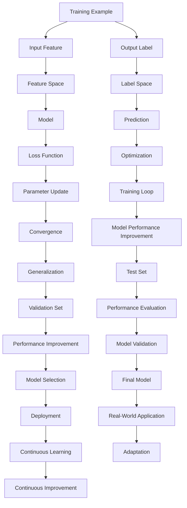

*A flowchart illustrating the process of training a machine learning model using training examples. The model learns from the input features and their corresponding output labels, adjusting its parameters to minimize the loss function and improve its performance on the training and validation sets.*

### Examples

#### Supervised Learning Example

In supervised learning, the training examples are pairs of input features and their corresponding output labels. For instance, in a handwritten digit recognition task, the training examples might consist of images of handwritten digits (input features) and their correct classifications (output labels). The algorithm learns to map the input features to the correct labels, enabling it to recognize new, unseen handwritten digits.

#### Reinforcement Learning Example

In reinforcement learning, the training examples are not explicitly labeled. Instead, the algorithm learns from a sequence of states, actions, and rewards. For example, in a game-playing scenario, the training examples might consist of sequences of game states, actions taken by the agent, and rewards received. The algorithm learns to choose actions that maximize the cumulative reward over time.

### Key Takeaways

- Training examples are the core data used to train machine learning models.
- They consist of input features and their corresponding output labels.
- The model learns from these examples to make accurate predictions on new data.
- The quality and quantity of training examples significantly impact the model's performance.

### Common Misconceptions

- ⚠️ Misconception: Training examples are only necessary for supervised learning. 
Correction: Reinforcement learning also relies on training examples, albeit implicitly through sequences of states, actions, and rewards.
- ⚠️ Misconception: More training examples always lead to better performance. 
Correction: While more data can improve performance, it is also important to ensure the data is representative and free from biases.

---

## 19. Learning Tasks {#learning-tasks}

### Definition

Learning tasks encompass a variety of problems that can be addressed using machine learning techniques. These tasks range from simple classification and regression problems to more complex tasks such as reinforcement learning and unsupervised learning. The goal of these tasks is to enable machines to learn from data and improve their performance over time.

### Intuition

Imagine a child learning to play a musical instrument. Initially, they might watch a video or listen to a teacher, but the true learning happens when they practice and receive feedback. Similarly, in machine learning, the 'child' (the machine) learns by being exposed to data (the 'teacher') and adjusting its behavior based on the results (feedback). This process can be applied to a wide range of tasks, from recognizing images to making decisions in complex environments.

### Diagram

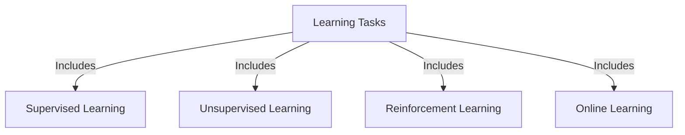

*Diagram illustrating the different types of learning tasks in machine learning.*

### Examples

#### Speech Recognition

A common application of machine learning is speech recognition, where the task is to convert spoken words into text. This involves supervised learning, where the machine is trained on large datasets of audio recordings paired with their corresponding text transcriptions. The model then learns to map the audio signals to the correct text.

#### Reinforcement Learning in Robotics

In robotics, reinforcement learning can be used to teach robots to navigate and perform tasks. For example, a robot might learn to avoid obstacles and reach a target location by receiving positive reinforcement (e.g., a reward) for successful actions and negative reinforcement (e.g., a penalty) for unsuccessful actions.

### Key Takeaways

- Learning tasks in machine learning encompass a wide range of problems from simple classification to complex decision-making processes.
- Supervised, unsupervised, and reinforcement learning are key types of learning tasks that can be applied to various domains.
- The goal of these tasks is to enable machines to learn from data and improve their performance over time.

### Common Misconceptions

- ⚠️ Misconception: All machine learning tasks require labeled data. 
Correction: While supervised learning tasks typically require labeled data, unsupervised and reinforcement learning can operate with unlabeled or partially labeled data.
- ⚠️ Misconception: Reinforcement learning is only useful for games. 
Correction: Reinforcement learning can be applied to a wide range of tasks, including robotics, autonomous vehicles, and complex decision-making processes in business and finance.

---

## 20. Algorithm Implementation {#algorithm-implementation}

### Definition

The practical application of learning algorithms to solve specific tasks, involving the design, implementation, and evaluation of algorithms that can learn from data and improve their performance over time.

### Intuition

Imagine you're teaching a computer to recognize cats in photos. You start by showing it many examples of cats and non-cats. The computer tries to understand what makes a cat a cat. Over time, it gets better at recognizing cats. This is the essence of algorithm implementation in machine learning. It's like training a student to recognize patterns and make decisions based on data, much like how you might train a dog to recognize certain commands.

### Diagram

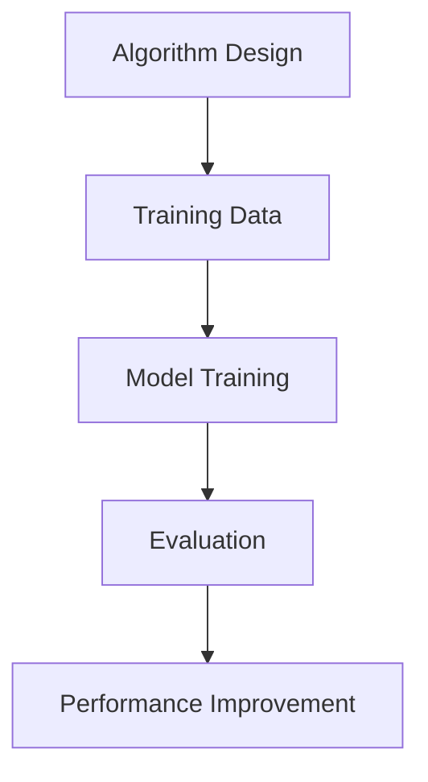

*Flowchart illustrating the process of algorithm implementation in machine learning.*

### Examples

#### Logistic Regression for Binary Classification

Consider a scenario where we want to classify emails as spam or not spam. We can use logistic regression, a discriminative learning algorithm, to model the probability of an email being spam. The logistic regression model is defined as: 

$$ P(y = 1 | x; 	heta) = rac{1}{1 + e^{-	heta^T x}} $$

where $y$ is the label (spam or not spam), $x$ is the input feature vector, and $	heta$ are the model parameters. We train the model using a dataset of labeled emails, and then use it to predict the probability of new emails being spam. If the probability exceeds a certain threshold, we classify the email as spam.

#### Generative Adversarial Networks (GANs)

GANs are a type of generative learning algorithm used for generating new data instances that are similar to the training data. For example, we can use GANs to generate new images of cats. The GAN consists of two parts: a generator network that creates new images, and a discriminator network that tries to distinguish between real and generated images. The generator tries to fool the discriminator, while the discriminator tries to correctly identify the real images. This adversarial process helps the generator learn to create more realistic images.

### Key Takeaways

- Understand the difference between discriminative and generative learning algorithms.
- Learn how to design, train, and evaluate machine learning models.
- Recognize the importance of data in the learning process.
- Understand the role of performance evaluation in improving model accuracy.

### Common Misconceptions

- ⚠️ Misconception: All machine learning models are created equal. 
Correction: Different models are suited for different tasks. For example, logistic regression is good for binary classification, while GANs are better for generating new data.
- ⚠️ Misconception: More data always leads to better performance. 
Correction: While more data can improve performance, it's also important to consider the quality and relevance of the data. Additionally, the model's architecture and training process also play crucial roles in performance.

---

## 21. Online Data Sets {#online-data-sets}

### Definition

Online data sets are collections of data that are continuously available for use in learning algorithms. These data sets can be updated dynamically and are often used in scenarios where real-time learning or continuous improvement is necessary.

### Intuition

Imagine you are training a machine learning model to recognize faces. Initially, you have a set of labeled images (training data). As you use the model, it encounters new faces (online data) that it hasn't seen before. These new faces are added to the data set, allowing the model to learn and improve continuously. This is akin to a student learning from their own experiences and feedback, much like how you might improve your face recognition skills by seeing and recognizing more faces over time.

### Diagram

```mermaid
graph TD;
A[Online Data Set]
B[Learning Algorithm]
C[Updated Model]
D[New Data]
A --> B
B --> C
C --> D
D --> A
```

*A flowchart illustrating the process of using online data sets in machine learning. The model continuously learns from new data and updates its parameters.*

### Examples

#### Face Recognition

Consider a machine learning model designed to recognize faces. Initially, it is trained on a set of labeled images. As the model encounters new faces in real-time, these images are added to the data set, allowing the model to learn and improve continuously. This is particularly useful in applications such as security systems or social media platforms where new faces are frequently encountered.

#### Financial Loan Analysis

A financial institution uses a machine learning model to analyze loan applications. The model is initially trained on a set of labeled loan applications. As new loan applications come in, they are added to the data set, enabling the model to learn from the latest trends and patterns in loan behavior. This helps the institution make more accurate and timely decisions.

### Key Takeaways

- Online data sets are crucial for continuous learning and improvement in machine learning models.
- These data sets can be updated dynamically, allowing models to adapt to new situations and trends.
- Using online data sets is particularly beneficial in scenarios where real-time learning or continuous improvement is necessary.

### Common Misconceptions

- ⚠️ Misconception: Online data sets are only useful for supervised learning. 
Correction: Online data sets can be used in various types of learning, including unsupervised learning and reinforcement learning. For example, clustering algorithms can use online data sets to continuously update their clusters as new data points are encountered.
- ⚠️ Misconception: Online data sets require manual updates. 
Correction: While manual updates are possible, many modern systems automatically update data sets based on real-time data collection and analysis.

---

## 22. Statistical Learning Theory {#statistical-learning-theory}

### Definition

Statistical Learning Theory is a framework for understanding the process of learning from data, focusing on the statistical properties of the learning algorithms and the data. It provides a rigorous mathematical foundation for machine learning, enabling the analysis of the generalization ability of learning algorithms. This theory is crucial for understanding how well a model can perform on unseen data, which is a key concern in practical applications of machine learning.

### Intuition

Imagine you are trying to learn a new language. You start by observing how people use words and phrases, and you try to mimic their behavior. However, simply mimicking isn't enough; you need to understand the underlying rules and patterns. Statistical Learning Theory is like having a set of rules that tells you how well your language learning will generalize to new sentences you haven't seen before. It helps you understand the trade-offs between the complexity of the model and the amount of data you have, ensuring that you don't overfit or underfit your model.

### Mathematical Formulation

**Vapnik-Chervonenkis Dimension**

$$
$$VC(	ext{dim}) = 	ext{max} igrace{ 	ext{size}(S) 	ext{ such that } orall S 	ext{ with } 	ext{size}(S) 	ext{, } 	ext{H}(S) 	ext{ is shattered by } 	ext{H}} ig\rbrace$$
$$

*The VC dimension is a measure of the capacity of a statistical model. It quantifies the complexity of a hypothesis space and is used to derive bounds on the generalization error.*

**Generalization Bound**

$$
$$Pig( |E_{in}(f) - E_{out}(f)| > 	ext{\epsilon} ig) 	ext{\leq} 	ext{\exp} ig( -2 	ext{\epsilon}^2 	ext{N} ig)$$
$$

*This is a fundamental inequality in statistical learning theory, which provides a probabilistic bound on the difference between the expected in-sample error and the expected out-of-sample error. Here, $E_{in}(f)$ is the in-sample error, $E_{out}(f)$ is the out-of-sample error, and $N$ is the number of training samples.*

### Diagram

```mermaid
graph TD;
A[Statistical Learning Theory]
B[Data]
C[Hypothesis Space]
D[Generalization Error]
A --> B
A --> C
C --> D
D --> B

```

*A flowchart illustrating the relationship between Statistical Learning Theory, data, hypothesis space, and generalization error. The theory provides a framework for understanding how well a model can generalize to unseen data.*

### Examples

#### Example: Vapnik-Chervonenkis Dimension

Consider a hypothesis space consisting of linear classifiers in a two-dimensional space. The VC dimension for this hypothesis space is 3, meaning that any set of 3 points can be shattered by this hypothesis space. However, as the number of points increases, the VC dimension increases, indicating a higher capacity for the model to fit the data, but also a higher risk of overfitting.

#### Example: Generalization Bound

Suppose we have a dataset with 1000 samples and we are using a hypothesis space with a VC dimension of 50. If we want to ensure that the difference between the in-sample and out-of-sample errors is less than 0.1 with a probability of at least 0.95, we can use the generalization bound to calculate the required number of samples. The bound suggests that with 1000 samples, the probability of the error difference exceeding 0.1 is very small.

### Key Takeaways

- Statistical Learning Theory provides a rigorous framework for understanding the generalization ability of learning algorithms.
- The VC dimension is a key concept in measuring the complexity of a hypothesis space.
- Generalization bounds help in understanding the trade-offs between model complexity and the amount of data.

### Common Misconceptions

- ⚠️ Misconception: Overfitting is always due to a high VC dimension. 
Correction: Overfitting can occur due to various reasons, including insufficient regularization, noisy data, or a model that is too complex for the available data. The VC dimension is just one factor in determining the risk of overfitting.
- ⚠️ Misconception: The generalization error is always zero. 
Correction: The generalization error is a measure of the difference between the in-sample and out-of-sample errors. It is expected to be non-zero, and the goal is to minimize this difference to ensure that the model performs well on unseen data.

---

## 23. Bayesian Learning {#bayesian-learning}

### Definition

A statistical approach to learning based on Bayesian inference, which involves updating the probability of a hypothesis as more evidence or data becomes available.

### Intuition

Imagine you're playing a game where you need to guess the color of a ball drawn from a bag. Initially, you might assume the ball is red because you've seen red balls before. As you draw more balls and observe their colors, you update your belief about the color of the next ball. This process of updating your belief based on new evidence is what Bayesian learning is all about. It's like continuously refining your guess based on the latest information you receive.

### Mathematical Formulation

**Bayes' Theorem**

$$
$P(H|E) = \frac{P(E|H)P(H)}{P(E)}$
$$

*The probability of a hypothesis $H$ given the evidence $E$ is proportional to the product of the probability of the evidence given the hypothesis and the prior probability of the hypothesis.*

**Prior Probability**

$$
$P(H)$
$$

*The probability of the hypothesis before any evidence is observed.*

**Likelihood**

$$
$P(E|H)$
$$

*The probability of observing the evidence $E$ given that the hypothesis $H$ is true.*

**Posterior Probability**

$$
$P(H|E)$
$$

*The probability of the hypothesis $H$ given the observed evidence $E$. This is the updated probability after incorporating the new evidence.*

**Evidence**

$$
$P(E)$
$$

*The probability of the evidence, which is often a normalizing constant to ensure the posterior probability sums to 1.*

### Diagram

```mermaid
graph TD;
A[New Evidence] --> B[Posterior Probability]
B --> C[Update Model]
C --> D[New Prediction]
D --> A

```

*A diagram illustrating the process of Bayesian learning, where new evidence is used to update the model and make predictions.*

### Examples

#### Weighted Majority Algorithm

In Lecture 1, the Weighted Majority Algorithm is discussed as a method for combining multiple learning methods. Suppose we have a set of experts making predictions, and we want to combine their predictions using Bayesian principles. Each expert's prediction is treated as a hypothesis, and their accuracy is used as the likelihood. The posterior probability of each expert's prediction is then used to weight their contribution to the final prediction.

#### Instance-Based Learning

In Chapter 8, instance-based learning methods such as nearest neighbor learning are described. For example, in a classification task, the posterior probability of a new instance belonging to a class can be estimated by looking at the class of the nearest neighbor in the training data. The distance between the new instance and its nearest neighbor can be used as the likelihood, and the prior probability can be estimated from the frequency of the class in the training data.

### Key Takeaways

- Understand the role of Bayesian inference in updating probabilities based on new evidence.
- Recognize how prior probabilities and likelihoods are used to compute posterior probabilities.
- Appreciate the flexibility and adaptability of Bayesian learning in various machine learning tasks.

### Common Misconceptions

- ⚠️ Misconception: Bayesian learning is only useful for simple problems. 
Correction: Bayesian learning can be applied to complex problems and large datasets, providing a principled way to incorporate uncertainty and prior knowledge.
- ⚠️ Misconception: Bayesian learning is computationally infeasible. 
Correction: While Bayesian learning can be computationally intensive, modern computational methods and approximations (e.g., variational inference) make it feasible for many practical applications.

---

## 24. Reinforcement Learning {#reinforcement-learning}

### Definition

A type of machine learning where an agent learns to take actions to maximize a reward. The agent interacts with an environment, receiving feedback in the form of rewards or penalties, and learns to make decisions that lead to the highest cumulative reward over time.

### Intuition

Imagine you are teaching a robot to navigate a maze. The robot doesn't know the optimal path beforehand. Instead, it tries different paths, receives feedback (a reward for reaching the end of the maze, or a penalty for hitting a wall), and adjusts its strategy accordingly. Over many trials, the robot learns the best path to take, maximizing its reward. This is the essence of reinforcement learning.

### Mathematical Formulation

**Markov Decision Process (MDP)**

$$
\text{An MDP is defined by a 5-tuple } (S, A, P, R, \gamma)\text{, where:}
$$

*S is the set of states, A is the set of actions, P is the transition probability function, R is the reward function, and \gamma is the discount factor.*

**Bellman Equation for Value Function**

$$
V_{\pi}(s) = \sum_{a \in A} \pi(a|s) \left( R(s, a) + \gamma \sum_{s' \in S} P(s'|s, a) V_{\pi}(s') \right)
$$

*This equation expresses the value of a state under a policy \pi, which is the expected sum of discounted future rewards.*

**Policy Evaluation**

$$
V_{\pi}(s) = \sum_{a \in A} \pi(a|s) \left( R(s, a) + \gamma \sum_{s' \in S} P(s'|s, a) V_{\pi}(s') \right)
$$

*This is the same as the Bellman Equation for Value Function, used to evaluate the value of a state under a given policy.*

**Policy Improvement**

$$
\pi'(a|s) = \begin{cases} 1 & \text{if } a = \operatorname{argmax}_{a'} \left( R(s, a') + \gamma \sum_{s' \in S} P(s'|s, a') V_{\pi}(s') \right) \\ 0 & \text{otherwise} \end{cases}
$$

*This equation describes how to improve a policy by selecting actions that maximize the expected future reward.*

**Policy Iteration Algorithm**

$$
\text{1. Initialize } \pi \text{ arbitrarily.} \\ \text{2. Evaluate } V_{\pi} \text{ using the Bellman Equation.} \\ \text{3. Improve } \pi \text{ using the Policy Improvement Equation.} \\ \text{4. Repeat steps 2 and 3 until convergence.}
$$

*This algorithm iteratively evaluates and improves the policy until it converges to an optimal policy.*

### Diagram

```mermaid
graph TD; A[Environment] --> B[Agent]; B --> C[Action]; C --> D[Observation]; D --> A; A --> E[Reward]; E --> B;
```

*A simple reinforcement learning loop where the agent takes actions in the environment, receives observations and rewards, and updates its policy accordingly.*

### Examples

#### Handwriting Recognition

In the context of handwriting recognition, the task is to classify handwritten words within images. The performance measure is the percent of words correctly classified. The agent learns to recognize patterns in the images and classify them correctly, receiving a reward for each correct classification and a penalty for incorrect ones.

#### Atari Game Playing

DeepMind demonstrated that a reinforcement learning system based on deep learning can learn to play Atari video games. The agent learns to play the game by trial and error, receiving rewards for winning and penalties for losing. Over time, the agent improves its strategy and learns to play the game at a high level.

### Key Takeaways

- Reinforcement learning is a type of machine learning where an agent learns to take actions to maximize a reward.
- The agent learns through trial and error, receiving feedback in the form of rewards or penalties.
- The process involves evaluating and improving the policy using the Bellman Equation and Policy Improvement Equation.

### Common Misconceptions

- ⚠️ Misconception: Reinforcement learning is only suitable for games and robotics. 
Correction: While games and robotics are popular applications, reinforcement learning can be applied to a wide range of tasks, including natural language processing, recommendation systems, and autonomous vehicles.
- ⚠️ Misconception: Reinforcement learning always requires a lot of data. 
Correction: Reinforcement learning can work with limited data, especially when combined with techniques like transfer learning and domain adaptation.

---

## 25. Supervised Learning {#supervised-learning}

### Definition

A type of learning where the system learns from labeled data. In supervised learning, the system is provided with input-output pairs, and the goal is to learn a mapping from inputs to outputs. This is in contrast to unsupervised learning, where the system learns from unlabeled data, and reinforcement learning, where the system learns from its own experience and rewards.

### Intuition

Imagine you are teaching a child to recognize fruits. You show the child a picture of an apple and label it as 'apple', then show a banana and label it as 'banana'. Over time, the child learns to recognize the features that distinguish apples from bananas. This is similar to how a machine learning model learns in supervised learning. The model is shown many examples of input-output pairs, and it learns to map the inputs to the correct outputs.

### Mathematical Formulation

**Loss Function**

$$
$L(y, \hat{y}) = \frac{1}{2}(y - \hat{y})^2$
$$

*The loss function measures the difference between the predicted output ($\hat{y}$) and the true output ($y$). The goal of supervised learning is to minimize this loss function.*

**Prediction Function**

$$
$\hat{y} = f(x; \theta)$
$$

*The prediction function $f$ takes an input $x$ and a set of parameters $\theta$ to produce a predicted output $\hat{y}$. The goal is to find the optimal parameters $\theta$ that minimize the loss function.*

### Diagram

```mermaid
graph TD;
A[Input Data]
B[Labeled Data]
C[Model]
D[Prediction]
E[Loss Function]
F[Optimization]
A--&gt;B
B--&gt;C
C--&gt;D
D--&gt;E
E--&gt;F
F--&gt;C

```

*Supervised Learning Process: The model learns from labeled data, makes predictions, and optimizes its parameters to minimize the loss function.*

### Examples

#### Housing Prices Prediction

Consider the dataset of housing prices given in Lecture 2. We can use a linear regression model to predict the price of a house based on its living area. The model learns the relationship between the input (living area) and the output (price) from the labeled data.

#### Email Spam Detection

Suppose we have a dataset of emails labeled as spam or not spam. We can use a classification model to predict whether a new email is spam or not. The model learns from the labeled data to distinguish between spam and non-spam emails.

### Key Takeaways

- Supervised learning involves learning from labeled data.
- The goal is to learn a mapping from inputs to outputs.
- The process involves predicting outputs, calculating a loss, and optimizing the model parameters.

### Common Misconceptions

- ⚠️ Misconception: Supervised learning can be used for any task. 
Correction: Supervised learning requires labeled data, which may not always be available or easy to obtain. Unsupervised learning and reinforcement learning are alternatives for tasks where labeled data is scarce or unavailable.
- ⚠️ Misconception: Supervised learning is the only type of learning. 
Correction: There are other types of learning, such as unsupervised learning and reinforcement learning, which are suited to different tasks and scenarios.

---

## 26. Unsupervised Learning {#unsupervised-learning}

### Definition

A type of learning where the system learns from unlabeled data. In unsupervised learning, the algorithm is not provided with labeled responses, and it must find the underlying structure in the data on its own.

### Intuition

Imagine you have a large collection of photographs, but none of them are labeled with categories. Unsupervised learning is like trying to group these photos into categories based on their visual content—perhaps grouping all the pictures of cats together, or all the pictures of landscapes. The algorithm must figure out what makes a picture similar to another without any explicit guidance on what categories to use.

### Mathematical Formulation

**K-means Clustering Objective Function**

$$
\min_{\mathbf{C}} \sum_{i=1}^{n} \| \mathbf{x}_i - \mathbf{c}_{z_i} \|^2
$$

*The objective function for K-means clustering, where \(\mathbf{C}\) is the set of cluster centroids, \(\mathbf{x}_i\) is a data point, and \(z_i\) is the index of the cluster to which \(\mathbf{x}_i\) is assigned.*

**Density Estimation**

$$
p(\mathbf{x}) = \frac{1}{nh} \sum_{i=1}^{n} K\left(\frac{\mathbf{x} - \mathbf{x}_i}{h}\right)
$$

*A formula for estimating the probability density function of a dataset using a kernel density estimator, where \(p(\mathbf{x})\) is the estimated density at point \(\mathbf{x}\), \(n\) is the number of data points, \(h\) is the bandwidth, and \(K\) is a kernel function.*

### Diagram

```mermaid
graph TD;
A[Unsupervised Learning]
B[Clustering]
C[Density Estimation]
D[Visualization]
A --> B
A --> C
A --> D
```

*Diagram illustrating the main tasks in unsupervised learning: Clustering, Density Estimation, and Visualization.*

### Examples

#### Clustering Example

Consider a dataset of customer purchase histories. Using unsupervised learning, we can cluster customers into different groups based on their purchasing behavior. For example, one cluster might represent customers who frequently buy groceries, another might represent those who buy electronics, and so on. This can help businesses tailor their marketing strategies to different customer segments.

#### Density Estimation Example

In a dataset of handwritten digits, we can use unsupervised learning to estimate the probability density of each digit. This can be useful for understanding the distribution of different digits in the dataset, which can then be used for tasks such as anomaly detection or data generation.

### Key Takeaways

- Understand that unsupervised learning involves finding structure in unlabeled data.
- Recognize that clustering, density estimation, and visualization are common tasks in unsupervised learning.
- Be aware of the importance of choosing appropriate algorithms and parameters for unsupervised learning tasks.

### Common Misconceptions

- ⚠️ Misconception: Unsupervised learning is the same as reinforcement learning. 
Correction: While both involve learning from experience, unsupervised learning focuses on finding structure in unlabeled data, whereas reinforcement learning involves learning from rewards and punishments in an environment.
- ⚠️ Misconception: Unsupervised learning is less powerful than supervised learning. 
Correction: Unsupervised learning can be just as powerful, and in some cases, even more so, as it can discover complex patterns and structures in data without the need for labeled data.

---

## 27. Recurrent Neural Networks {#recurrent-neural-networks}

### Definition

A type of neural network designed to process sequences of inputs, where the network's output at each time step is fed back into the network as input at the next time step. This allows the network to maintain a form of memory, capturing temporal dependencies in the data.

### Intuition

Imagine a network that can remember what it has seen before. Unlike a regular neural network, which sees each input independently, a recurrent neural network (RNN) can see the entire sequence of inputs. Think of it as a student who remembers what was taught in the previous class, allowing them to build on that knowledge in the current class. This memory allows the network to understand the context and dependencies between different elements in the sequence.

### Mathematical Formulation

**Hidden State Update**

$$
$h_t = \sigma(W_{hh}h_{t-1} + W_{xh}x_t + b_h)$
$$

*The hidden state $h_t$ at time $t$ is computed as a function of the previous hidden state $h_{t-1}$, the current input $x_t$, and the bias $b_h$. The function $\sigma$ is typically a non-linear activation function like the sigmoid or ReLU.*

**Output Prediction**

$$
$y_t = \sigma(W_{hy}h_t + b_y)$
$$

*The output $y_t$ at time $t$ is predicted from the current hidden state $h_t$ and the bias $b_y$. The function $\sigma$ is again a non-linear activation function.*

### Diagram

```mermaid
graph TD;
A[Input Sequence] --> B[Hidden State Update];
B --> C[Output Prediction];
C --> D[Output Sequence];
B --> B[Feedback Loop];

```

*A simple RNN processing a sequence of inputs. The hidden state is updated at each time step, and the output is predicted. The feedback loop allows the network to maintain a form of memory.*

### Examples

#### Sentiment Analysis

Consider a task where the network needs to predict the sentiment of a sentence. The input sequence is the sequence of words in the sentence. The hidden state at each time step captures the sentiment up to that word, and the output at the last time step is the predicted sentiment. For example, given the sentence 'I love this movie', the network would update its hidden state as it processes each word, and the final output would be a positive sentiment.

#### Language Modeling

In language modeling, the network predicts the next word in a sentence. Given the sequence of words 'I love', the hidden state at the third time step captures the context of the first two words, and the output is the probability distribution over all possible next words. For example, the network might predict 'this' as the next word with a high probability.

### Key Takeaways

- RNNs are designed to process sequences of inputs by maintaining a hidden state that captures temporal dependencies.
- The hidden state is updated at each time step using a feedback loop, allowing the network to remember past inputs.
- RNNs can be used for tasks such as sentiment analysis and language modeling.

### Common Misconceptions

- ⚠️ Misconception: RNNs are only suitable for short sequences. 
Correction: While RNNs can struggle with long sequences due to vanishing or exploding gradients, techniques like Long Short-Term Memory (LSTM) and Gated Recurrent Units (GRU) have been developed to address these issues and allow RNNs to handle longer sequences effectively.
- ⚠️ Misconception: RNNs are the only type of neural network that can process sequences. 
Correction: While RNNs are specifically designed for this purpose, other architectures like Convolutional Neural Networks (CNNs) and Transformer models can also process sequences, albeit in different ways.

---

## 28. Convolutional Neural Networks {#convolutional-neural-networks}

### Definition

A type of neural network that is particularly good at image recognition, characterized by the use of convolutional layers that apply filters to the input to extract features.

### Intuition

Imagine you're trying to recognize a cat in a picture. A convolutional neural network (CNN) would break down the image into smaller parts and apply filters (like edge detectors) to find patterns. These patterns are then combined to form a more complex representation of the image, ultimately leading to the recognition of a cat. This is akin to how your brain processes visual information, breaking it down into simpler components and then combining them to form a coherent understanding.

### Mathematical Formulation

**Convolution Operation**

$$
$$(f * k)(x) = \sum_{u} f(u)k(x-u)$$
$$

*The convolution operation between a function $f$ and a kernel $k$ at point $x$ is the sum of the product of $f(u)$ and $k(x-u)$ for all $u$.*

**Activation Function**

$$
$a(x) = \sigma(f * k)(x)$$
$$

*After applying the convolution, the result is passed through an activation function $\sigma$ to introduce non-linearity.*

### Diagram

```mermaid
graph TD;
A[Input Image] --> B[Convolution Layer 1];
B --> C[Activation Function];
C --> D[Pooling Layer];
D --> E[Flattening];
E --> F[Dense Layer];
F --> G[Output];

```

*A simplified flowchart illustrating the process of a convolutional neural network, from input to output.*

### Examples

#### Example 1: Image Recognition

Consider an image of a cat. The CNN applies a series of convolutional filters to detect edges, corners, and other features. These features are then passed through activation functions to introduce non-linearity. The pooled and flattened features are then fed into a dense layer to classify the image as a cat or not.

#### Example 2: Feature Extraction

In a CNN, a filter $k$ is applied to an input image $f$ to produce a feature map. For instance, a filter might be designed to detect horizontal edges. The convolution operation is given by $(f * k)(x) = \sum_{u} f(u)k(x-u)$. After applying the filter, the result is passed through an activation function, such as the ReLU function, to ensure non-linearity.

### Key Takeaways

- CNNs are specialized for image recognition due to their ability to extract hierarchical features from images.
- The convolution operation combines the input image with a filter to produce a feature map.
- Activation functions are used to introduce non-linearity and enable the network to learn complex patterns.

### Common Misconceptions

- ⚠️ Misconception: CNNs are only used for image recognition. 
Correction: While CNNs are particularly effective for image recognition, they can also be applied to other types of structured data, such as graphs and sequences, through adaptations like Graph Convolutional Networks (GCNs).
- ⚠️ Misconception: CNNs are computationally expensive. 
Correction: While CNNs can be computationally intensive, they are designed to be efficient through techniques like weight sharing and pooling, which reduce the number of parameters and computations needed.

---

## 29. Decision Trees {#decision-trees}

### Definition

A type of machine learning model that uses a tree-like structure to make decisions based on input features. Each internal node represents a test on a feature, each branch represents the outcome of the test, and each leaf node represents a class label or decision.

### Intuition

Imagine you're trying to decide whether to bring an umbrella to work. You might start by checking the weather forecast (a feature). If it's raining, you bring the umbrella (a decision). If it's sunny, you might check the temperature next. This process of making decisions based on features can be visualized as a tree, with each branch representing a decision path.

### Mathematical Formulation

**Information Gain**

$$
$IG(S, a) = H(S) - H(S|a)$
$$

*Information Gain measures the reduction in entropy (uncertainty) after splitting the data on feature $a$. $H(S)$ is the entropy of the dataset $S$, and $H(S|a)$ is the weighted average of the entropies of the subsets created by splitting $S$ on $a$.*

**Gini Impurity**

$$
$G(S) = 1 - rac{1}{|S|} 	imes 	ext{sum}(|S_i| 	imes (	ext{1 - } rac{|S_i|}{|S|}))$
$$

*Gini Impurity measures the probability of incorrectly classifying a randomly chosen element from the dataset. It is used as an alternative to entropy in decision trees.*

### Diagram

```mermaid
graph TD;
A[Root Node]
B1(Test on Feature 1)
C1[True]
D1[False]
B2(Test on Feature 2)
C2[True]
D2[False]
C1-->E1[Class 1]
D1-->E2[Class 2]
C2-->E3[Class 3]
D2-->E4[Class 4]
A--Feature 1-->B1
B1--True-->C1
B1--False-->D1
A--Feature 2-->B2
B2--True-->C2
B2--False-->D2;
```

*A simple decision tree illustrating the process of making decisions based on features.*

### Examples

#### Weather Decision Tree

Consider a decision tree for deciding whether to bring an umbrella. The root node is the weather forecast. If it's raining, the decision is to bring the umbrella. If it's sunny, the next test is the temperature. If it's warm, no umbrella is needed. If it's cold, the decision is to bring the umbrella. This tree helps in making decisions based on the available features.

#### Credit Card Approval Decision Tree

A financial institution might use a decision tree to approve or deny credit card applications. The root node could be the applicant's income. If the income is high, the decision might be to approve. If the income is moderate, the next test could be the credit score. If the score is good, the decision is to approve. If the score is poor, the decision is to deny. This tree helps in making decisions based on the applicant's financial data.

### Key Takeaways

- Decision trees are a powerful tool for making decisions based on input features.
- They can be used for both classification and regression tasks.
- Information Gain and Gini Impurity are metrics used to evaluate the quality of splits in decision trees.

### Common Misconceptions

- ⚠️ Misconception: Decision trees are only useful for simple problems. 
Correction: While they can be used for simple problems, they are also effective for complex, multi-dimensional data. They can handle both categorical and numerical features.
- ⚠️ Misconception: Decision trees are prone to overfitting. 
Correction: While they can be prone to overfitting, techniques such as pruning and setting maximum depth can help mitigate this issue.

---

## 30. Random Forests {#random-forests}

### Definition

A type of machine learning model that combines multiple decision trees to improve predictive accuracy and control over-fitting. Each tree in the forest is built from a bootstrap sample of the data, and a random subset of features is considered for splitting at each node. The final prediction is made by aggregating the predictions of all the individual trees.

### Intuition

Imagine you have a group of friends who are all good at guessing what you're thinking. Each friend makes their own guess, and then you take the average of all their guesses to get a more accurate prediction. This is similar to how a Random Forest works. Each decision tree in the forest makes its own prediction, and then the final prediction is made by averaging the predictions of all the trees. This helps to reduce the error and make the prediction more robust.

### Mathematical Formulation

**Bootstrap Sampling**

$$
\text{Bootstrap sample} = \{x_i \mid i \in \{1, 2, \ldots, n\}, x_i \text{ is drawn with replacement from the original dataset}\}
$$

*Each tree in the forest is built using a bootstrap sample of the data, which means that each sample is drawn with replacement from the original dataset. This allows each tree to have a slightly different view of the data.*

**Random Subset of Features**

$$
\text{Random subset of features} = \{f_j \mid j \in \{1, 2, \ldots, m\}, f_j \text{ is randomly selected from the feature set}\}
$$

*At each node in the tree, a random subset of features is considered for splitting. This helps to reduce the correlation between the trees and improve the diversity of the forest.*

**Aggregation of Predictions**

$$
\hat{y} = \frac{1}{T} \sum_{t=1}^{T} \hat{y}_t
$$

*The final prediction is made by averaging the predictions of all the individual trees. Here, \(\hat{y}\) is the final prediction, \(T\) is the total number of trees, and \(\hat{y}_t\) is the prediction of the \(t\)-th tree.*

### Diagram

```mermaid
graph TD
    A[Bootstrap Sample]
    B[Random Subset of Features]
    C[Decision Tree 1]
    D[Decision Tree 2]
    E[Decision Tree 3]
    F[...]
    G[Final Prediction]
    A --> B
    B --> C
    B --> D
    B --> E
    B --> F
    C --> G
    D --> G
    E --> G
    F --> G
```

*A Random Forest consists of multiple decision trees, each built from a bootstrap sample and a random subset of features. The final prediction is made by aggregating the predictions of all the trees.*

### Examples

#### Example 1: Predicting House Prices

Suppose we have a dataset of house prices with features such as square footage, number of bedrooms, and location. We can build a Random Forest to predict the price of a house. Each tree in the forest would be built using a bootstrap sample of the data and a random subset of the features. The final prediction would be the average of the predictions of all the trees.

#### Example 2: Predicting Stock Prices

Another example could be predicting stock prices. We can use a Random Forest to make predictions based on historical stock prices, trading volumes, and other financial indicators. Each tree in the forest would be built using a bootstrap sample of the data and a random subset of the features. The final prediction would be the average of the predictions of all the trees.

### Key Takeaways

- Random Forests are a type of ensemble learning method that combines multiple decision trees to improve predictive accuracy and control over-fitting.
- Each tree in the forest is built from a bootstrap sample of the data and a random subset of the features.
- The final prediction is made by aggregating the predictions of all the individual trees.

### Common Misconceptions

- ⚠️ Misconception: Random Forests are just a collection of decision trees. 
Correction: While Random Forests do consist of multiple decision trees, they are more than just a collection. They are a specific type of ensemble learning method that combines the predictions of multiple trees to improve accuracy and control over-fitting.
- ⚠️ Misconception: Random Forests are only useful for classification tasks. 
Correction: Random Forests can be used for both classification and regression tasks. They are a versatile tool in the machine learning toolbox.

---

*End of lecture notes: Machine Learning*
